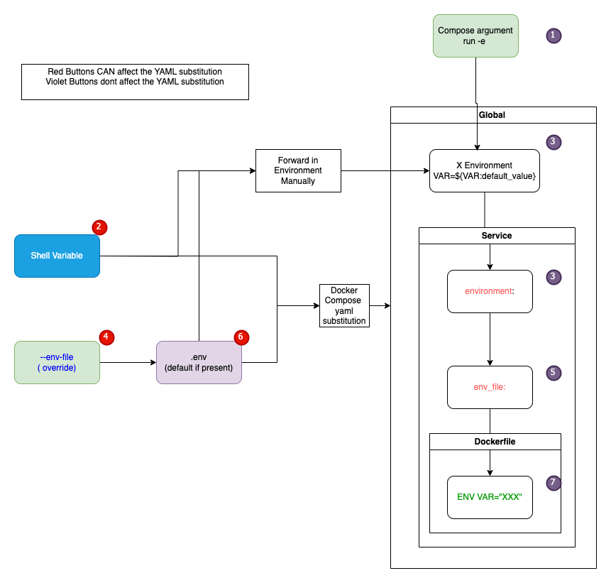

This project demonstrates Environment variables in docker and their accessibility

Execution

Setup:

        export SHELLVAR="ThisIsDeclaredInShell"
        export SHELLVARFORWARD="ThisIsDeclaredInShellToBeForwarded"

Standard execution

       docker compose up

To use the override 

        export SHELLVARFORWARDWITHDEFAULT="ThisIsDeclaredInShellToNotBeDefaulted" 

        docker compose --env-file env-file-override.env up

 

